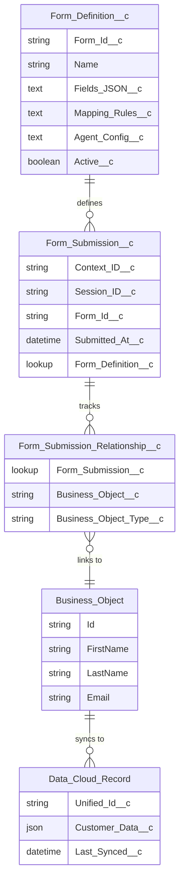

# Context Broker - Complete Architecture Documentation

**Version**: 1.0  
**Last Updated**: 2024  
**Status**: Production

---

## Table of Contents

1. [Executive Summary](#executive-summary)
2. [System Architecture Overview](#system-architecture-overview)
3. [The "Holy Trinity" - Three Domain System](#the-holy-trinity---three-domain-system)
4. [Component Interactions](#component-interactions)
5. [Data Flow Diagrams](#data-flow-diagrams)
6. [Authentication & Authorization Flows](#authentication--authorization-flows)
7. [Form Submission Flow](#form-submission-flow)
8. [Agent Interaction Flows](#agent-interaction-flows)
9. [UI Agent Command Flow](#ui-agent-command-flow)
10. [Session Management Flow](#session-management-flow)
11. [Salesforce & Data Cloud Integration](#salesforce--data-cloud-integration)
12. [Error Handling & Resilience](#error-handling--resilience)
13. [Deployment Architecture](#deployment-architecture)
14. [Security Architecture](#security-architecture)
15. [Performance & Scalability](#performance--scalability)

---

## Executive Summary

The **Context Broker** is a metadata-driven, form-agnostic system that bridges enterprise customer websites with Salesforce & Data Cloud, enabling AI agents to enhance user experiences through dynamic form management, intelligent field mapping, and real-time UI control.

### Key Capabilities

- **Form-Agnostic Design**: Single broker supports multiple forms, pages, and websites. This means one broker implementation can be reused across different customer websites and forms without code changes.

- **Agent-Enabled UI**: AI agents can observe and control web pages through standardized commands. Agents can see what users are doing and help them interact with forms in real-time.

- **Metadata-Driven Configuration**: All form definitions, mappings, and business logic stored in Salesforce. Forms are configured in Salesforce, not hardcoded, making them easy to update without deploying code.

- **Context Preservation**: Sessions maintain context across OAuth flows, async operations, and page reloads. User interactions are remembered even when they authenticate or refresh the page.

- **Secure Authentication**: OAuth 2.0 with refresh token management for persistent sessions. Users can authenticate securely, and their sessions remain active across multiple visits.

- **Real-Time Interaction**: Agent commands and UI events flow through broker in real-time. Agents can respond immediately to user actions and help guide them through forms.

### The "Holy Trinity"

The system consists of three independent domains working together:

1. **Customer Website** (Frontend): React or any enterprise web application
2. **Broker Plane** (API Layer): Node.js/Express middleware orchestrating communication
3. **Salesforce & Data Cloud** (Backend): Business logic, form definitions, and data storage

---

## System Architecture Overview

This section shows how the three domains (Customer Website, Broker Plane, and Salesforce & Data Cloud) work together. Understanding this helps you see why the system is designed this way and what benefits it provides.

**Why This Matters**: The architecture separates concerns so each domain has a specific job. This makes the system easier to maintain, scale, and extend to new websites and forms.

**Benefits**: 
- Changes to forms don't require code deployments
- New websites can be added without modifying the broker
- Business logic stays in Salesforce where business users can manage it
- The system can scale each domain independently

**How It Works**: The customer website sends requests to the broker, which validates and routes them to Salesforce. The broker doesn't contain business logic - it just orchestrates communication between the frontend and backend.

### High-Level Architecture Diagram


### Component Stack


---

## The "Holy Trinity" - Three Domain System

### Domain Responsibilities

```mermaid
graph TB
    subgraph "Customer Website Domain"
        FW[Frontend Responsibilities]
        FW1[✓ Form Rendering<br/>Dynamic from Schema]
        FW2[✓ Session Management<br/>localStorage]
        FW3[✓ UI Agent Integration<br/>Modal Control, Focus]
        FW4[✓ Agent-Triggered Auth Modals]
        FW5[✗ NO Direct Salesforce Calls]
        FW6[✗ NO Business Logic]
    end

    subgraph "Broker Plane Domain"
        BW[Broker Responsibilities]
        BW1[✓ Session Management<br/>Temporary Store]
        BW2[✓ Form Definition Retrieval]
        BW3[✓ Context ID Validation]
        BW4[✓ Salesforce API Proxying]
        BW5[✓ Agent Command Routing]
        BW6[✓ OAuth Flow Orchestration]
        BW7[✓ Token Management<br/>Encrypted]
        BW8[✗ NO Business Rules]
    end

    subgraph "Salesforce and Data Cloud Domain"
        SW[Salesforce Responsibilities]
        SW1[✓ Form Definitions<br/>Form_Definition__c]
        SW2[✓ Form Submissions<br/>Form_Submission__c]
        SW3[✓ Business Logic<br/>Flows, Apex]
        SW4[✓ Agent Conversations]
        SW5[✓ Authentication Triggers<br/>Apex]
        SW6[✓ Data Cloud Integration<br/>Customer Data]
        SW7[✗ NO UI Rendering]
        SW8[✗ NO Session Management]
    end

    FW -->|HTTP REST| BW
    BW -->|OAuth 2.0 + REST| SW
    SW -->|Form Metadata| BW
    BW -->|Form Schema| FW
```



### Communication Patterns


---

## Component Interactions

This section shows the detailed components within each domain and how they communicate. This helps you understand the internal structure of each system and how components depend on each other.

**Why This Matters**: Understanding component interactions helps when debugging issues, adding features, or optimizing performance. You can see which components are responsible for specific functionality.

**Benefits**:
- Clear separation of responsibilities makes code easier to understand
- Components can be modified independently without breaking others
- You can identify bottlenecks or optimization opportunities
- New developers can quickly understand how the system works

**How It Works**: Each component has a specific role. Frontend components handle user interface, broker routes handle API requests, broker services handle business logic, and Salesforce objects store data and configuration.

### Detailed Component Architecture


---

## Data Flow Diagrams

This section shows how data flows through the system. Understanding data flow helps you trace how user actions become Salesforce records and how context is preserved throughout the process.

**Why This Matters**: Context IDs are critical - they link everything together. They connect form sessions to form submissions to business records. Without proper context flow, data can be lost or mislinked.

**Benefits**:
- All user interactions can be traced back to their session
- Form submissions are linked to the correct business records
- Agents can understand user context throughout their journey
- Data relationships are preserved across async operations

**How It Works**: When a user loads a form, a context ID is created (formId:sessionId). This context ID is included in every request, allowing the system to maintain context even when the user authenticates or submits forms asynchronously.

### Context ID Flow (Critical Pattern)

```mermaid
sequenceDiagram
    participant User
    participant Website
    participant Broker
    participant Salesforce

    User->>Website: Loads Form Page
    Website->>Website: Generate Session ID (UUID v4)
    Website->>Website: Create Context ID: formId:sessionId
    Website->>Website: Store in localStorage

    Website->>Broker: GET /api/forms/:formId?contextId=formId:sessionId
    Broker->>Broker: Parse Context ID
    Broker->>Broker: Validate Format (formId:uuid)
    Broker->>Broker: Store Session (formId, sessionId)
    
    Broker->>Salesforce: Query Form_Definition__c WHERE Form_Id__c = formId
    Salesforce-->>Broker: Form Metadata
    Broker-->>Website: Form Schema + Mapping Rules

    Note over Website, Salesforce: User Submits Form
    Website->>Broker: POST /api/forms/:formId/submit<br/>{contextId: "formId:sessionId", formData}
    Broker->>Broker: Parse and Validate Context ID
    Broker->>Broker: Get Session by Context ID
    Broker->>Salesforce: Query Form_Definition__c<br/>(get Mapping_Rules__c)
    Salesforce-->>Broker: Mapping Rules
    Broker->>Broker: Apply Transformations<br/>(e.g., split name)
    Broker->>Broker: Map Form Fields → Salesforce Fields
    Broker->>Salesforce: Create Business Record (Lead/Contact)
    Salesforce-->>Broker: Record ID
    Broker->>Salesforce: Create Form_Submission__c<br/>(Context_ID__c, Session_ID__c)
    Broker->>Salesforce: Create Form_Submission_Relationship__c<br/>(Link to Business Record)
    Salesforce-->>Broker: Success
    Broker-->>Website: Submission Complete
```



### Session Data Flow

```mermaid
graph LR
    subgraph "Frontend"
        LS[localStorage<br/>sessionId, formId, contextId]
    end

    subgraph "Broker"
        SM[Session Map<br/>sessionId → SessionData<br/>24h TTL]
    end

    subgraph "Salesforce"
        FS[Form_Submission__c<br/>Context_ID__c<br/>Session_ID__c]
    end

    LS -->|Create Session| SM
    SM -->|Store Session| SM
    SM -->|On Submit| FS
    FS -->|Permanent Record| FS

    style LS fill:#e1f5ff
    style SM fill:#fff4e1
    style FS fill:#e8f5e9
```



---

## Authentication & Authorization Flows

### OAuth 2.0 Authorization Code Flow


### Token Refresh Flow


### Authentication Architecture

**Why This Matters**: The system uses two types of authentication - service account (for broker operations) and user authentication (for form submissions). This separation ensures the broker can always access Salesforce while users only authenticate when needed.

**Benefits**:
- Service account tokens persist, so broker operations always work
- Users only authenticate when submitting forms that require it
- Tokens are automatically refreshed before they expire
- Each user session has its own tokens, keeping data isolated

**How It Works**: The service account authenticates once and stores a refresh token. The broker uses this to get access tokens for queries. Users authenticate per-session when needed, and their tokens are linked to their context ID. The token manager automatically refreshes tokens before they expire.


---

## Form Submission Flow

### Complete Form Submission Process

```mermaid
sequenceDiagram
    participant User
    participant Website
    participant Broker
    participant Transform
    participant Salesforce

    User->>Website: Fills Out Form
    User->>Website: Clicks Submit

    Website->>Broker: POST /api/forms/:formId/submit<br/>{contextId: "formId:sessionId",<br/>formData: {...}}

    Broker->>Broker: Validate Context ID Format<br/>(formId:uuid)
    Broker->>Broker: Parse Context ID<br/>{formId, sessionId}
    Broker->>Broker: Validate Session Exists<br/>(getSessionByContextId)
    
    alt Session Not Found
        Broker-->>Website: 404 Session Not Found
    end

    Broker->>Salesforce: Query Form_Definition__c<br/>WHERE Form_Id__c = formId<br/>(Get Mapping_Rules__c)
    
    alt Form Not Found
        Broker-->>Website: 404 Form Not Found
    end

    Salesforce-->>Broker: Form Record<br/>{Mapping_Rules__c: {...}}

    Broker->>Broker: Parse Mapping_Rules__c JSON

    alt JSON Parse Error
        Broker-->>Website: 400 Mapping Rules Parse Error
    end

    Broker->>Transform: Apply Transformations<br/>(e.g., split name field)
    Transform->>Transform: Split "name" → "FirstName", "LastName"
    Transform-->>Broker: Transformed Form Data

    Broker->>Broker: Apply Static Field Mappings<br/>(formField → salesforceField)
    Broker->>Broker: Apply Conditional Mappings<br/>(if conditions match)

    alt No Fields Mapped
        Broker-->>Website: 400 Field Mapping Missing
    end

    Broker->>Salesforce: Create Business Record<br/>(Lead/Contact/Account)<br/>{FirstName, LastName, Email, ...}

    alt Record Creation Fails
        Broker-->>Website: 503/401 Salesforce Error<br/>(with error details)
    end

    Salesforce-->>Broker: Record Created<br/>{Id: "00X..."}

    Broker->>Salesforce: Create Form_Submission__c<br/>{Context_ID__c: "formId:sessionId",<br/>Session_ID__c: "sessionId",<br/>Form_Id__c: "formId"}

    Salesforce-->>Broker: Form_Submission__c Created<br/>{Id: "a0X..."}

    Broker->>Salesforce: Create Form_Submission_Relationship__c<br/>{Form_Submission__c: "a0X...",<br/>Business_Object__c: "00X...",<br/>Business_Object_Type__c: "Lead"}

    Salesforce-->>Broker: Relationship Created

    Broker-->>Website: 200 Success<br/>{submissionId, businessRecordId, ...}
    Website-->>User: Show Success Message
```



### Field Mapping & Transformation Flow

**Why This Matters**: Form fields often need to be transformed before being saved to Salesforce. For example, a single "name" field might need to be split into "FirstName" and "LastName". This flow shows how data moves from the form to Salesforce with transformations applied.

**Benefits**:
- Form fields can be simplified for users (single "name" field)
- Data is automatically formatted correctly for Salesforce
- Business rules can be applied during transformation (e.g., phone number formatting)
- Transformations are configurable in Salesforce, not hardcoded

**How It Works**: First, transformations are applied to form data (like splitting names). Then, transformed data is mapped to Salesforce fields using static and conditional mappings. Finally, the mapped data is used to create business records in Salesforce.

```mermaid
graph LR
    subgraph "Form Data"
        FD[Form Data<br/>name: John Doe<br/>email: john@example.com]
    end

    subgraph "Transformations"
        T1[Split Name<br/>name → FirstName + LastName]
        T2[Format Phone<br/>phone → cleaned format]
        T3[Custom Transformations<br/>from Mapping_Rules__c]
    end

    subgraph "Field Mappings"
        FM1[Static Mappings<br/>email → Email<br/>phone → Phone]
        FM2[Conditional Mappings<br/>if country equals US<br/>then add US fields]
    end

    subgraph "Salesforce Record"
        SR[Business Record<br/>FirstName: John<br/>LastName: Doe<br/>Email: john@example.com]
    end

    FD -->|Step 1: Transform| T1
    T1 --> T2
    T2 --> T3
    T3 -->|Step 2: Map Static| FM1
    FM1 -->|Step 3: Map Conditional| FM2
    FM2 -->|Step 4: Create| SR

    style FD fill:#e1f5ff
    style T1 fill:#fff4e1
    style FM1 fill:#ffe1e1
    style SR fill:#e8f5e9
```



---

## Agent Interaction Flows

### Agent Query Flow (Natural Language)


### Agent-Driven Authentication Flow


---

## UI Agent Command Flow

### UI Observation Flow (Website → Broker)


### UI Command Flow (Broker → Website)


### UI Agent Architecture


---

## Session Management Flow

### Session Lifecycle


### Session Storage Architecture

```mermaid
graph LR
    subgraph "Frontend Storage"
        LS[localStorage<br/>sessionId: UUID<br/>formId: string<br/>contextId: string<br/>TTL: 24h]
    end

    subgraph "Broker Storage"
        SM[Session Map<br/>sessionId → SessionData<br/>- formId<br/>- contextId<br/>- formData<br/>- agentContext<br/>- expiresAt<br/>TTL: 24h]
    end

    subgraph "Salesforce Storage"
        FS[Form_Submission__c<br/>Context_ID__c: string<br/>Session_ID__c: UUID<br/>Form_Id__c: string<br/>Permanent Record]
    end

    LS <-->|Create/Update| SM
    SM -->|On Submit| FS
    FS -->|Permanent| FS

    style LS fill:#e1f5ff
    style SM fill:#fff4e1
    style FS fill:#e8f5e9
```



---

## Salesforce & Data Cloud Integration

### Salesforce Custom Objects Architecture



### Data Cloud Integration Flow

```mermaid
sequenceDiagram
    participant Broker
    participant Salesforce
    participant DataCloud

    Broker->>Salesforce: Create Business Record<br/>(Lead/Contact/Account)
    Salesforce-->>Broker: Record Created

    Salesforce->>DataCloud: Trigger Sync<br/>(Record Change Event)

    alt Automatic Sync
        DataCloud->>DataCloud: Create/Update Unified Record<br/>(Customer Profile)
        DataCloud->>DataCloud: Enrich with External Data<br/>(Third-party sources)
        DataCloud-->>Salesforce: Sync Status
    end

    Note over Broker, DataCloud: Agent Queries Data Cloud
    Broker->>Salesforce: Agent Query<br/>(With Data Cloud context)
    Salesforce->>DataCloud: Query Unified Customer Data
    DataCloud-->>Salesforce: Enriched Customer Profile
    Salesforce-->>Broker: Agent Response<br/>(With Data Cloud insights)

    Note over Broker, DataCloud: Real-Time Personalization
    Broker->>Salesforce: Form Load Request
    Salesforce->>DataCloud: Get Customer Profile<br/>(by email/phone)
    DataCloud-->>Salesforce: Customer Preferences<br/>(from unified profile)
    Salesforce->>Salesforce: Personalize Form<br/>(Pre-fill fields, show/hide sections)
    Salesforce-->>Broker: Personalized Form Schema
```

### Salesforce-Data Cloud Architecture

```mermaid
graph TB
    subgraph "Salesforce Org"
        SO[Salesforce Objects<br/>Form_Definition__c<br/>Form_Submission__c<br/>Lead/Contact/Account]
        SF[Salesforce Flows<br/>Business Logic]
        AC[Apex Classes<br/>Agent Logic<br/>Data Cloud Integration]
    end

    subgraph "Data Cloud"
        DC[Data Cloud Platform<br/>Unified Customer Profiles]
        DE[Data Enrichment<br/>External Data Sources]
        DR[Data Relationships<br/>Identity Resolution]
    end

    subgraph "Integration Points"
        ICE[Change Events<br/>Real-Time Sync]
        APEX[Apex Callouts<br/>Data Cloud Queries]
        FLOW[Flow Actions<br/>Data Cloud Connectors]
    end

    SO -->|Change Events| ICE
    ICE -->|Sync| DC
    DC -->|Enrich| DE
    DE -->|Resolve| DR

    AC -->|Query| APEX
    APEX -->|Query Unified Data| DC
    DC -->|Return Profile| AC

    SF -->|Use Data Cloud| FLOW
    FLOW -->|Get Customer Data| DC

    style SO fill:#e8f5e9
    style DC fill:#f3e5f5
    style ICE fill:#fff4e1
```

---

## Error Handling & Resilience

### Error Response Architecture

**Why This Matters**: When things go wrong, the system provides clear, actionable error messages. This helps developers debug issues quickly and helps end users understand what happened and what to do next.

**Benefits**:
- Errors are categorized by type, making them easier to handle
- Error messages include troubleshooting steps
- Users get friendly messages, not technical jargon
- Errors help identify root causes (network issues, configuration problems, etc.)

**How It Works**: When an error occurs, the system categorizes it by type (connection error, validation error, etc.) and creates a structured error response with a technical message, user-friendly message, resolution steps, and troubleshooting guidance. This helps both technical and non-technical users understand and resolve issues.

```mermaid
graph TB
    subgraph "Error Types"
        ET1[SALESFORCE_CONNECTION_ERROR<br/>503 Service Unavailable]
        ET2[SALESFORCE_AUTH_ERROR<br/>401 Unauthorized]
        ET3[FORM_NOT_FOUND<br/>404 Not Found]
        ET4[VALIDATION_ERROR<br/>400 Bad Request]
        ET5[PARSING_ERROR<br/>400 Bad Request]
        ET6[INTERNAL_ERROR<br/>500 Internal Server Error]
    end

    subgraph "Error Response Structure"
        ER[Error Response<br/>type: ErrorType<br/>message: string<br/>details: object<br/>userMessage: string<br/>resolution: string<br/>troubleshooting: array]
    end

    subgraph "Error Sources"
        ES1[Salesforce API<br/>Connection Failures]
        ES2[Form Definition<br/>Not Found]
        ES3[JSON Parsing<br/>Invalid Format]
        ES4[Validation<br/>Invalid Input]
        ES5[Session<br/>Expired/Not Found]
    end

    ES1 --> ET1
    ES1 --> ET2
    ES2 --> ET3
    ES3 --> ET5
    ES4 --> ET4
    ES5 --> ET4

    ET1 --> ER
    ET2 --> ER
    ET3 --> ER
    ET4 --> ER
    ET5 --> ER
    ET6 --> ER

    style ET1 fill:#ffebee
    style ET2 fill:#ffebee
    style ET3 fill:#fff3e0
    style ET4 fill:#fff3e0
    style ET5 fill:#fff3e0
    style ET6 fill:#f3e5f5
```

### Error Flow Example

```mermaid
sequenceDiagram
    participant Website
    participant Broker
    participant Salesforce

    Website->>Broker: POST /api/forms/:formId/submit<br/>{contextId, formData}

    Broker->>Broker: Validate Context ID
    
    alt Invalid Context ID Format
        Broker-->>Website: 400 Validation Error<br/>{type: "VALIDATION_ERROR",<br/>message: "Invalid contextId format",<br/>userMessage: "Context ID must be formId:uuid",<br/>resolution: "Ensure contextId format is correct",<br/>troubleshooting: ["Check contextId format",<br/>"Regenerate contextId if needed"]}
    end

    Broker->>Salesforce: Query Form_Definition__c
    
    alt Salesforce Connection Error
        Salesforce-->>Broker: Connection Timeout
        Broker->>Broker: Detect Error Type<br/>(SALESFORCE_CONNECTION_ERROR)
        Broker-->>Website: 503 Service Unavailable<br/>{type: "SALESFORCE_CONNECTION_ERROR",<br/>message: "Failed to connect to Salesforce",<br/>userMessage: "Salesforce is temporarily unavailable",<br/>resolution: "Retry the request in a few moments",<br/>troubleshooting: ["Check Salesforce status",<br/>"Verify network connectivity",<br/>"Contact support if issue persists"]}
    end

    alt Form Not Found
        Salesforce-->>Broker: No Records Found
        Broker->>Broker: Detect Error Type<br/>(FORM_NOT_FOUND)
        Broker-->>Website: 404 Not Found<br/>{type: "FORM_NOT_FOUND",<br/>message: "Form definition not found",<br/>userMessage: "The requested form does not exist",<br/>resolution: "Verify the formId is correct",<br/>troubleshooting: ["Check formId in URL",<br/>"Ensure Form_Definition__c exists in Salesforce",<br/>"Verify Form_Id__c matches"]}
    end

    Broker->>Broker: Parse Mapping_Rules__c JSON
    
    alt JSON Parse Error
        Broker->>Broker: Detect Error Type<br/>(PARSING_ERROR)
        Broker-->>Website: 400 Bad Request<br/>{type: "PARSING_ERROR",<br/>message: "Failed to parse Mapping_Rules__c",<br/>userMessage: "Form configuration is invalid",<br/>resolution: "Fix JSON syntax in Form_Definition__c",<br/>troubleshooting: ["Validate JSON syntax",<br/>"Check Mapping_Rules__c field",<br/>"Test JSON with validator"]}
    end
```

---

## Deployment Architecture

### Deployment Topology

```mermaid
graph TB
    subgraph "Customer Website Deployment"
        GH[GitHub Pages<br/>Static Site<br/>React Build]
        CDN[CDN<br/>Static Assets]
    end

    subgraph "Broker Deployment"
        HK[Heroku<br/>Node.js API<br/>Express Server]
        REDIS[Redis<br/>Session Storage<br/>Token Cache]
        ENV[Environment Variables<br/>Secrets]
    end

    subgraph "Salesforce Deployment"
        PROD[Production Org<br/>Salesforce Instance]
        SANDBOX[Sandbox Org<br/>Testing Environment]
        SFDX[Salesforce CLI<br/>Deployment Tool]
    end

    GH -->|Deploy gh-pages branch| CDN
    HK -->|Uses| REDIS
    HK -->|Configures| ENV
    SFDX -->|Deploy force-app| PROD
    SFDX -->|Deploy force-app| SANDBOX

    CDN -->|HTTPS| HK
    HK -->|OAuth 2.0 + REST| PROD
    HK -->|OAuth 2.0 + REST| SANDBOX

    style GH fill:#e1f5ff
    style HK fill:#fff4e1
    style PROD fill:#e8f5e9
```

### Deployment Flow

```mermaid
sequenceDiagram
    participant Developer
    participant Git
    participant GitHub
    participant Heroku
    participant Salesforce

    Note over Developer, Salesforce: Frontend Deployment
    Developer->>Git: git push origin main
    Git->>GitHub: Push Changes
    GitHub->>GitHub: Build React App<br/>(npm run build)
    GitHub->>GitHub: Deploy to gh-pages<br/>(./scripts/deploy-github.sh)

    Note over Developer, Salesforce: Broker Deployment
    Developer->>Git: git push heroku main<br/>(from broker/ directory)
    Git->>Heroku: Deploy Broker
    Heroku->>Heroku: Install Dependencies<br/>(npm install)
    Heroku->>Heroku: Build TypeScript<br/>(tsc)
    Heroku->>Heroku: Start Server<br/>(npm start)

    Note over Developer, Salesforce: Salesforce Deployment
    Developer->>Salesforce: sfdx force:source:deploy<br/>-p salesforce/force-app<br/>-u production
    Salesforce->>Salesforce: Validate Deployment
    Salesforce->>Salesforce: Deploy Metadata<br/>(Objects, Classes, Flows)
    Salesforce-->>Developer: Deployment Complete
```

---

## Security Architecture

### Security Layers

```mermaid
graph TB
    subgraph "Frontend Security"
        CORS[CORS Configuration<br/>Allowed Origins]
        HTTPS[HTTPS Only<br/>No HTTP]
        XSS[XSS Protection<br/>Content Security Policy]
    end

    subgraph "Broker Security"
        AUTH[OAuth 2.0<br/>Authorization Code Flow]
        VALID[Input Validation<br/>Context ID, Form Data]
        ENCRYPT[Token Encryption<br/>Refresh Tokens]
        RATE[Rate Limiting<br/>500 req/15min]
    end

    subgraph "Salesforce Security"
        FLS[Field-Level Security<br/>Profile Permissions]
        CRUD[CRUD Permissions<br/>Object Access]
        IP[IP Restrictions<br/>Connected App]
        STATE[State Parameter<br/>OAuth Validation]
    end

    CORS --> AUTH
    HTTPS --> ENCRYPT
    XSS --> VALID
    AUTH --> STATE
    VALID --> CRUD
    ENCRYPT --> FLS
    RATE --> IP

    style CORS fill:#e1f5ff
    style AUTH fill:#fff4e1
    style FLS fill:#e8f5e9
```

### Security Flow

```mermaid
sequenceDiagram
    participant Website
    participant Broker
    participant Salesforce

    Note over Website, Salesforce: Request Security
    Website->>Broker: POST /api/forms/:formId/submit<br/>{contextId: "formId:sessionId",<br/>formData: {...}}
    
    Broker->>Broker: Validate Context ID Format<br/>(Prevent Injection)
    Broker->>Broker: Validate Session Exists<br/>(Prevent Unauthorized)
    Broker->>Broker: Sanitize Form Data<br/>(XSS Protection)

    Broker->>Salesforce: Query Form_Definition__c<br/>(With Service Account Token)

    alt Service Account Token Expired
        Broker->>Salesforce: Refresh Token Request
        Salesforce-->>Broker: New Access Token
    end

    Broker->>Salesforce: Create Business Record<br/>(Field-Level Security Enforced)

    Salesforce->>Salesforce: Validate FLS Permissions<br/>(Integration User Profile)

    alt FLS Permission Denied
        Salesforce-->>Broker: Field Not Accessible
        Broker-->>Website: 403 Forbidden<br/>(with helpful error)
    end

    Salesforce-->>Broker: Record Created
    Broker-->>Website: 200 Success

    Note over Website, Salesforce: User Authentication Security
    Website->>Broker: POST /api/agent/auth/initiate<br/>{contextId}
    
    Broker->>Broker: Generate State Parameter<br/>(Cryptographically Random)
    Broker->>Broker: Store State in Session<br/>(Link to contextId)

    Broker-->>Website: OAuth URL<br/>(with state parameter)

    Website->>Salesforce: Redirect to OAuth<br/>(state included)
    Salesforce->>Broker: OAuth Callback<br/>(code, state)

    Broker->>Broker: Validate State Parameter<br/>(Prevent CSRF)
    
    alt Invalid State
        Broker-->>Website: 400 Invalid State<br/>(Security Error)
    end

    Broker->>Salesforce: Exchange Code for Token<br/>(with client_secret)
    Salesforce-->>Broker: Access Token + Refresh Token
    Broker->>Broker: Encrypt and Store Tokens
    Broker->>Broker: Link User to Context ID
    Broker-->>Website: Auth Complete
```

---

## Performance & Scalability

### Performance Optimizations

```mermaid
graph TB
    subgraph "Frontend Optimizations"
        THROTTLE[Event Throttling<br/>Snapshots: 1s<br/>Fields: 500ms<br/>Focus: 200ms]
        DEBOUNCE[Debounce Field Changes<br/>500ms delay]
        LAZY[Lazy Loading<br/>Form Components]
    end

    subgraph "Broker Optimizations"
        CACHE[Session Caching<br/>In-Memory/Redis]
        POOL[Connection Pooling<br/>jsforce Connections]
        RATE[Rate Limiting<br/>500 req/15min<br/>5000 events/15min]
    end

    subgraph "Salesforce Optimizations"
        BULK[Bulk API<br/>Bulk Operations]
        INDEX[Indexed Fields<br/>Form_Id__c, Context_ID__c]
        QUERY[Query Optimization<br/>Selective WHERE clauses]
    end

    THROTTLE --> CACHE
    DEBOUNCE --> POOL
    LAZY --> RATE
    CACHE --> INDEX
    POOL --> QUERY
    RATE --> BULK

    style THROTTLE fill:#e1f5ff
    style CACHE fill:#fff4e1
    style BULK fill:#e8f5e9
```

### Scalability Architecture

```mermaid
graph LR
    subgraph "Horizontal Scaling"
        LB[Load Balancer<br/>Multiple Broker Instances]
        B1[Broker Instance 1<br/>Node.js/Express]
        B2[Broker Instance 2<br/>Node.js/Express]
        B3[Broker Instance N<br/>Node.js/Express]
        REDIS[(Redis Cluster<br/>Shared Session Storage)]
    end

    subgraph "Data Scaling"
        SF[Salesforce Org<br/>Unlimited Records]
        DC[Data Cloud<br/>Big Data Platform]
    end

    LB --> B1
    LB --> B2
    LB --> B3
    B1 --> REDIS
    B2 --> REDIS
    B3 --> REDIS
    REDIS --> SF
    SF --> DC

    style LB fill:#fff4e1
    style REDIS fill:#ffe1e1
    style SF fill:#e8f5e9
    style DC fill:#f3e5f5
```

---

## Key Takeaways

### Architecture Principles

1. **🎯 Metadata-Driven**: All form definitions, mappings, and business logic stored in Salesforce
2. **🔄 Form-Agnostic**: Single broker supports multiple forms, pages, and websites
3. **🤖 Agent-Enabled**: AI agents can observe and control web pages through standardized commands
4. **🔐 Secure by Default**: OAuth 2.0, input validation, field-level security, rate limiting
5. **⚡ Performance-Focused**: Throttling, debouncing, caching, connection pooling
6. **📊 Context Preservation**: Sessions maintain context across OAuth flows and async operations
7. **🌐 Scalable**: Horizontal scaling with Redis, connection pooling, bulk operations

### The "Holy Trinity" Benefits

- **Customer Website**: Fast, responsive UI with agent integration
- **Broker Plane**: Secure, performant API layer with no business logic
- **Salesforce & Data Cloud**: Unified customer data, business logic, and agent intelligence

### How Agents Extend Possibilities

1. **Real-Time UI Control**: Agents can open modals, focus fields, navigate pages
2. **Intelligent Form Assistance**: Natural language queries about form fields
3. **Context-Aware Personalization**: Data Cloud integration provides enriched customer profiles
4. **Proactive Authentication**: Agents can trigger OAuth flows when needed
5. **Dynamic Form Adaptation**: Forms adapt based on customer data and agent logic

---

## Related Documentation

- [`API_ERROR_RESPONSES.md`](./API_ERROR_RESPONSES.md) - Standardized error response format
- [`MAPPING_TEMPLATES.md`](./MAPPING_TEMPLATES.md) - Reusable mapping templates
- [`UI_AGENT_BLUEPRINT.md`](./UI_AGENT_BLUEPRINT.md) - UI Agent implementation details
- [`BROKER_GENERALIZATION_ASSESSMENT.md`](./BROKER_GENERALIZATION_ASSESSMENT.md) - Reusability assessment
- [`.cursorrules`](../.cursorrules) - Project rules and patterns

---

**Document Version**: 1.0  
**Last Updated**: 2024  
**Maintained By**: Context Broker Development Team


