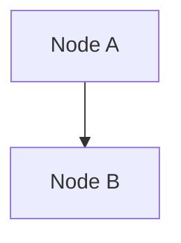

# Cursor Mermaid Diagram Troubleshooting

## Issue: Mermaid Diagrams Not Rendering in Cursor Preview

### ✅ Solutions (Try in Order)

#### Solution 1: Use "Markdown Preview Enhanced" Extension

**This extension has better Mermaid support:**

1. **Install the extension** (already installed):
   - Extension ID: `shd101wyy.markdown-preview-enhanced`
   
2. **Open the markdown file**:
   - Open `docs/ARCHITECTURE_COMPLETE.md`
   
3. **Right-click in the editor**:
   - Right-click anywhere in the markdown file
   - Select: **"Markdown Preview Enhanced: Open Preview to the Side"**
   
   OR
   
   - Press `Ctrl+Shift+P` (Windows/Linux) or `Cmd+Shift+P` (Mac)
   - Type: `Markdown Preview Enhanced: Open Preview to the Side`
   - Select it

4. **Mermaid diagrams should now render!** ✨

---

#### Solution 2: Check Extension is Enabled

1. Open Extensions panel:
   - `Cmd+Shift+X` (Mac) or `Ctrl+Shift+X` (Windows/Linux)
   - Or: Click Extensions icon in sidebar

2. Search for: `markdown-preview-enhanced`

3. Verify it shows **"Enabled"** (not "Disabled")

4. If disabled, click **"Enable"**

5. Reload Cursor:
   - `Cmd+Shift+P` → `Developer: Reload Window`
   - Or restart Cursor

---

#### Solution 3: Use Command Palette

1. Open `docs/ARCHITECTURE_COMPLETE.md`

2. Press `Cmd+Shift+P` (Mac) or `Ctrl+Shift+P` (Windows/Linux)

3. Type: `Markdown Preview Enhanced`

4. You should see options:
   - `Markdown Preview Enhanced: Open Preview`
   - `Markdown Preview Enhanced: Open Preview to the Side`
   - `Markdown Preview Enhanced: Toggle Live Update`

5. Select: **"Open Preview to the Side"**

6. Mermaid diagrams should render in the preview pane!

---

#### Solution 4: Check File Format

Make sure your Mermaid code blocks use the correct format:

```markdown

```

**NOT:**
```markdown
```markdown
graph TB
    ...
```
```

The language tag must be `mermaid`, not `markdown` or empty.

---

#### Solution 5: Test with Mermaid Live Editor

To verify your diagrams are syntactically correct:

1. Copy a diagram code block (between ```mermaid and ```)
2. Go to: https://mermaid.live/
3. Paste the code
4. If it renders there, the syntax is correct
5. If it doesn't, fix the syntax first

---

#### Solution 6: Use GitHub (Guaranteed to Work)

Since Cursor extensions can be finicky, **GitHub is the most reliable option**:

1. Your file is already on GitHub:
   ```
   https://github.com/DavidVickers/context-broker/blob/main/docs/ARCHITECTURE_COMPLETE.md
   ```

2. Open that URL in your browser

3. All Mermaid diagrams will render automatically! 🎉

**This is the simplest solution** - GitHub has native Mermaid support built-in.

---

#### Solution 7: Check Cursor-Specific Settings

Cursor might have different behavior. Try:

1. Open Command Palette: `Cmd+Shift+P`
2. Type: `Preferences: Open User Settings (JSON)`
3. Add these settings:
   ```json
   {
     "markdown.mermaid.enabled": true,
     "markdown-preview-enhanced.enableMermaid": true,
     "markdown-preview-enhanced.enableScriptExecution": true
   }
   ```
4. Save and reload Cursor

---

### 🔍 Debugging Steps

If none of the above work:

1. **Check Extension Status**:
   ```
   - Open Extensions panel
   - Search: "markdown"
   - Check if extensions are enabled
   - Look for error messages
   ```

2. **Check Console for Errors**:
   ```
   - Press Cmd+Option+I (Mac) or Ctrl+Shift+I (Windows)
   - Look for JavaScript errors
   - Check Network tab for failed requests
   ```

3. **Try Different Preview Method**:
   ```
   - Try the built-in VS Code preview (Cmd+Shift+V)
   - Try Markdown Preview Enhanced (Ctrl+Shift+P → "Markdown Preview Enhanced")
   - Try opening in browser (right-click → "Open in Browser")
   ```

---

### ✅ Recommended Quick Fix

**If you need to see the diagrams RIGHT NOW:**

1. **Open GitHub in your browser**:
   ```
   https://github.com/DavidVickers/context-broker/blob/main/docs/ARCHITECTURE_COMPLETE.md
   ```
   - This will render all diagrams immediately
   - No extensions needed
   - Guaranteed to work

2. **For editing in Cursor**:
   - Keep the GitHub page open in a browser tab
   - Edit in Cursor
   - Refresh GitHub page to see updated diagrams

---

### 🎯 Best Practice

**Dual Setup:**
- **Viewing**: Use GitHub (reliable, always works)
- **Editing**: Use Cursor with Markdown Preview Enhanced extension
- **Testing**: Use https://mermaid.live/ for individual diagrams

---

### 📝 Extension Commands Reference

Once Markdown Preview Enhanced is working, you can use:

- `Cmd+Shift+P` → `Markdown Preview Enhanced: Open Preview` - Opens preview in new tab
- `Cmd+Shift+P` → `Markdown Preview Enhanced: Open Preview to the Side` - Opens preview side-by-side
- `Cmd+Shift+P` → `Markdown Preview Enhanced: Toggle Live Update` - Auto-refresh on save
- `Cmd+Shift+P` → `Markdown Preview Enhanced: Export (pdf)` - Export as PDF

---

## Still Not Working?

1. **Verify extension is installed**:
   ```bash
   code --list-extensions | grep markdown
   ```
   Should show: `shd101wyy.markdown-preview-enhanced`

2. **Try restarting Cursor completely**

3. **Use GitHub** - it's the most reliable option! 🎉

---

**Quick Links:**
- GitHub: https://github.com/DavidVickers/context-broker/blob/main/docs/ARCHITECTURE_COMPLETE.md
- Mermaid Live: https://mermaid.live/
- Extension Docs: https://marketplace.visualstudio.com/items?itemName=shd101wyy.markdown-preview-enhanced

